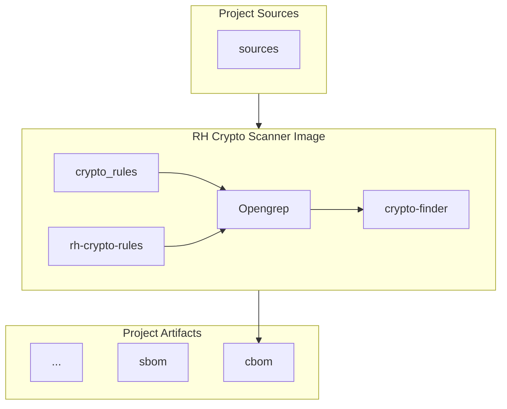

# rh-crypto-scanner-image

## Introduction

This is a container image used to scan for cryptographic assets.

It's based on [crypto-finder](https://github.com/scanoss/crypto-finder) which uses [Opengrep](https://github.com/opengrep/opengrep) as the default engine.

Additionally it integrates Semgrep/Opengrep rules defined in different repositories.

## Description

This image includes the following:

- An [Opengrep](https://github.com/opengrep/opengrep) released binary.
- A released [crypto-finder](https://github.com/scanoss/crypto-finder) tool.
- Open Source Rules from ScanOSS [open-crypto-rules](https://github.com/scanoss/open-crypto-rules).
- Open Source Rules from [rh-crypto-rules](https://github.com/rh-pvsec/rh-crypto-rules). Internal overlay rules that don't fit in the upstream repo. Mostly rules for detecting libraries and frameworks usage.

Additional repos can be mounted on top of this, for example:
- Propietary rules from ScanOSS upstream repo [crypto_rules](https://github.com/scanoss/crypto_rules) where Red Hat is contributing.



It also includes a default entrypoint to facilitate its usage.
You only need to provide a source folder to scan (usually mapped as a volume).

## Usage

The image is being built in konflux pipeline and distributed here: `docker://images.paas.redhat.com/exd-sp-guild-security/rh-crypto-scanner-image:latest`.

You need to map the sources to scan inside the container, for example in the following command we mount the `./src` folder into `/workspace` and we specify it as an additional argument:

```bash
podman run -v ./src:/workspace:z --rm  docker://images.paas.redhat.com/exd-sp-guild-security/rh-crypto-scanner-image:latest /workspace > cbom.json
```

You will get as standard output a CBOM CycloneDX with components of crypto-assets described.

You can review the defined ENTRYPOINT in the [Containerfile](Containerfile), in case you need to remove or replace an already provided argument you can override it like:

```bash
$ podman run -v ./src:/workspace:z --rm -ti --entrypoint crypto-finder docker://images.paas.redhat.com/exd-sp-guild-security/rh-crypto-scanner-image:latest scan --help
Scan source code repositories for cryptographic algorithm usage.

        The scan command executes a scanner (default: OpenGrep) against the target
        directory or file using specified rules. By default, it outputs findings to
        stdout in JSON format. Use --output to write to a file instead.

        Examples:
          # Scan with default JSON output to stdout
          crypto-finder scan --rules-dir ./rules /path/to/code

          # Save output to a file
          crypto-finder scan --rules-dir ./rules --output results.json /path/to/code

          # Pipe output to jq for processing
          crypto-finder scan --rules-dir ./rules /path/to/code | jq '.findings | length'

          # Scan with multiple rule files
          crypto-finder scan --rules rule1.yaml --rules rule2.yaml /path/to/code

          # Override language detection
          crypto-finder scan --languages java,python --rules-dir ./rules/ /path/to/code

          # Fail on findings (for CI/CD)
          crypto-finder scan --fail-on-findings --rules-dir ./rules/ /path/to/code

Usage:
  crypto-finder scan [target] [flags]

Flags:
      --api-key string          SCANOSS API key
      --api-url string          SCANOSS API base URL
      --fail-on-findings        Exit with error if findings detected
  -f, --format string           Output format: json, cyclonedx (default: json) (default "json")
  -h, --help                    help for scan
      --interfile               Enable cross-file analysis (Semgrep Pro only, adds --pro flag)
      --languages strings       Override language detection (comma-separated)
      --max-stale-age string    Maximum age for stale cache fallback (e.g., 30d, 720h, 2w, max: 90d) (default "30d")
      --no-cache                Force fresh download of remote rules, bypass cache
      --no-dedup                Disable per-line deduplication of findings
      --no-remote-rules         Disable default remote ruleset
  -o, --output string           Output file path (default: stdout)
  -r, --rules stringArray       Rule file path (repeatable)
      --rules-dir stringArray   Rule directory path (repeatable)
      --scanner string          Scanner to use (default: opengrep) (default "opengrep")
      --strict                  Fail if cache expired and API unreachable (no stale cache fallback)
  -t, --timeout string          Scan timeout (e.g., 10m, 1h, 30d, 2w) (default "10m")

Global Flags:
  -d, --debug     Enable debug logging
  -q, --quiet     Enable quiet logging
  -v, --verbose   Enable verbose logging
```

## Example

Use the following minimal sample repo for an example based on OpenSSL library:

```bash
git clone https://gitlab.cee.redhat.com/security-guild/crypto-scanning/sample/rsa-signer-c.git
podman run -v ./rsa-signer-c:/workspace:z --rm  docker://images.paas.redhat.com/exd-sp-guild-security/rh-crypto-scanner-image:latest /workspace > cbom.json
# Scan Summary

 • Files with findings: 3
 • Total crypto assets: 19
 • Output: <stdout>
cat cbom.json
{
  "bomFormat": "CycloneDX",
  "specVersion": "1.6",
  "serialNumber": "urn:uuid:6ddc2b7e-f774-4379-a604-3d40ec8e389d",
...
```

### CBOMs examples

- Repo: [rsa-signer-c](https://gitlab.cee.redhat.com/security-guild/crypto-scanning/sample/rsa-signer-c.git)
  CBOM: [rsa-signer-c.json](sample/cbom/rsa-signer-c.json)
- Repo: [openshift-installer](https://github.com/openshift/installer)
  CBOM: [openshift-installer.json](sample/cbom/openshift-installer.json)
- Repo: [linux-6.19](https://www.kernel.org/pub/linux/kernel/v6.x/linux-6.19.tar.gz)
  CBOM: [linux-6.19.json](sample/cbom/linux-6.19.json) (scan took 130 minutes on a Lenovo P1 G7)